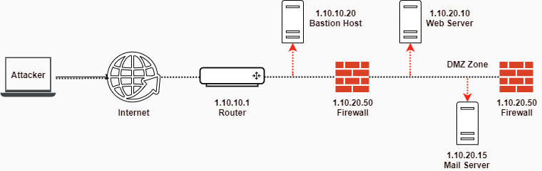

# Module 02: Footprinting and Reconnaissance


**Objectives**

* Understanding Footprinting Concepts
* Understanding Footprinting Through Search Engines And Advanced Google Hacking Techniques
* Understanding Footprinting Through Web Services And Social Network Sites
* Understanding Website Footprinting An Email Footprinting
* Understanding WHOIS, DNS and NEtwork Footprinting
* Understanding Footprinting Through Social Engineering
* Understanding Different Footprinting Tools And Countermeasures


## 1. Footprinting Concepts

### What is Footprinting

First step of any attack on information systems in which an attacker _collect information about a target network_ to identify various ways to intrude into the system.

Objectives:

1. Knowledge of security posture
2. Reduction of focus area
3. Identifying vulnerabilities
4. Drawing of network map

### Types of Footprinting

* **Passive Footprinting**: Gathering information about the target without direct interaction.
* **Active Footprinting**: Gathering information about the target with direct interaction.

### Information Obtained In Footprinting

* **Organization information**: Employee details, telephone numbers, location, background of the organization, web technologies, etc.
* **Network information**: Domain and sub-domains, network blocks, IP addresses of the reachable systems, Whois record, DNS, etc.
* **System information**: OS and location of web servers, users and passwords, etc.

## 2. Footprinting Methodology

* Attackers use search engines to extract information about the target, such as employed technology platforms, employee details, login pages and intranet portal, which help the attacker to perform social engineering and other types of advanced system attacks.
* Attackers can use advanced search operators available with these search engines and create complex queries to find, filter and sort specific information about the target.
* Search engines are also used to find other sources of publicly accessible information resources. Example: you can type "top job portals" to find major job portals that provide critical information about the target organization..
* Major search engines: Google, Bing, Yahoo!, Ask.com, Aol, Baidu, DuckDuckGo.

### Footprinting Using Advanced Google Hacking Techniques

Google hacking refers to the use of advanced Google search operators for _creating complex search queries_ to extract sensitive or hidden information that helps attackers _find vulnerable targets_.

#### Popular Google advance search operators

* `cache:` : Displays the web pages stored in the Google cache.
* `link:` : Lists web pages that have links to the specified web page.
* `related:`: Lists web pages that are similar to the specified web page.
* `info:` : Presents some information that Google has about a particular web page.
* `site:` : Restricts the results to those websites in the given domain.
* `allintitle:` : Restricts the results to those websites containing all the search keywords in the title.
* `intitle:` : Restricts the results to documents containing the search keyword in title.
* `allinurl:` : Restricts the results to those containing all the search keywords in the URL.
* `inurl:` : Restrict sthe results to documents containing the search keyworkd in the URL.
* `location:` : Finds information for a specific location.

#### Google Hacking Database \(GHDB\)

* GHDB is an authoritative source for querying the ever-widening reach of the Google search engine maintained by [Offensive Security](https://www.exploit-db.com).
* Attackers use [Google Dorks](https://www.exploit-db.com/google-hacking-database) in Google advanced search operators to extract sesitive information about their target, such as vulnerable servers, error messages, sensitive files, login pages and websites.

#### VoIP and VPN Footprinting through Google Hacking Database

**Google search queries for VoIP footprinting**

* `intitle:"Login Page" intext:"Phone Adapter Configuration Utility"`: Pages containing login portals.
* `inurl:/voice/advanced/ intitle:Linksys SPA configuration`: Finds the Linksys VoIP router configuration page.
* `intitle:"D-Link VIP Router" "Welcome"`: Pages containing D-Link login portals.
* `intitle:asterisk.management.portal web-access`: Lookf for the Asterisk management portal.
* `intitle:"SPA504G Configuration"`: Finds Cisco SPA504G Configuration Utility for IP phones.
* `inurl:8080 intitle:"login" intext:"UserLogin" "English"`: VoIP login portals.
* `intitle:"Sipura.SPA.Configuration" -.pdf`: Finds configuration pages for online VoIP devices.

**Google search queries for VPN footprinting**

* `filetytpe:pcf "cisco" "GroupPwd"`: Cisco VPN files with Group Passwords for remote access.
* `"[main] "enc_GroupPwd=" ext:txt`: Finds Cisco VPN client passwords \(encrypted but easily cracked!\).
* `"Config" intitle:"Index of" intext:vpn`: Directory with keys of VPN servers.
* `inurl:/remote/login?lang=en`: Finds FortiGate Firewall's SSL-VPN login portal.
* `!Host=*.* intext:enc_UserPassword=* ext:pcf`: Looks for profile configuration files \(.pcf\), which contain user VPN profiles.
* `filetype:rcf inurl:vpn`: Finds Sonicwall Global VPN Client files containing sensitive information and login.
* `filetype:pcf vpn OR Group`: Finds publicly accessible .pcf used by VPN clients.

### Other Techniques For Footprinting Through Search Engines

#### Gathering Information Using Google Advance Search And Advance Image Search

* Attackers can use them to achieve the same precision as that of using the advanced operators but without typing or remembering the operators.
* Using Google's Advanced search option, attackers can _find sites that may link back to the target organization's website_.

#### Gathering Information Using Reverse Image Search

* Reverse image search helps an attacker in tracking the original source and details of images, search as photographs, profile pictures and memes.
* Attackers can use online tools such as Google Image Search, TinEye Reverse Image Search and Yahoo Image Search to perform reverse image search.

#### Gathering Information From Video Search Engines

* Video search engiles such as Youtube, and Google Videos allo attackers to search for a video content related to the target.
* Attackers can further analyze the video content to _gather hidden information_ such as time/date and thumbnail of the video.
* Using video analysis tools such as Youtube DataViewer and EZGif, an attacker can reverse and convert video to text formats to extract critical information about the target.

#### Gathering Information From Meta Search Engines

* Meta search engines use other search engines \(Google, Bink, Ask.com, etc.\) to produce their won results from the Internet.
* Attackers use meta search engines such as Startpage and MetaGer to _gather more detailed information about the target_, such as images, videos, blogs and news articles from different sources.

#### Gathering information from FTP Search Engines

* FTP search engines are used to search for files located on the FTP servers.
* Attackers use FTP search engines, such as NAPALM FTP Indexer and Global FTP Search Engine to retrieve critical files and directories about the target that reveal valuable information such as business strategy, tax documents and employee's personal records.

#### Gathering Information from IoT Search Engines

* IoT search engines crawl the Internet for IoT devices that publicly accessible.
* Attackers use IoT search engines, such as Shodan, Censys and Thingful to gather information about the target IoT devices, such as manufacturer details, geographical location, IP address, hostnames and open ports.

### Finding a Company's Top-Level Domains \(TLDs\) and Sub-domains

* Search for the target company's external URL in a search engine, such as Google and Bing.
* Sub-domains provide an insight into different departments and business units in an organization.
* You may find a company's sub-domains by trial and error method or using a service such as [Netcraft](https://netcraft.com).
* You can use the [Sublist3r](https://github.com/aboul3la/Sublist3r) python script, which enumerates subdomains across multiple sources at once.

### Finding The You Graphical Location Of The Target

* Google Earth, Google Maps and Wikimapia to obtain the physical location of the target, which helps them to perform social engineering and other non-technical attacks.
* These tools help attackers to find or locate entrances to buildings, security cameras, gates, places to hide, weak spots in perimeter fences, etc.

### People Search On Social Networking Sites In People Search Services

* Facebook, Twitter or LinkedIn provide useful information about the individual that helps the attacker in performing social engineering and other attacks.
* The people search can provide critical information about a person or an organization, including location, emails, websites, blogs, contacts, important dates, etc.
* People search online services such as Intelius, pipl, BeenVerified, Whitepages and PeekYou provide people's names, addresses, contact details, date of birth, photographs, videos, profession, and so on.

#### LinkedIn

* Attackers use [theHarvester](https://github.com/laramies/theHarvester) tool to perform enumeration on LinkedIn and find employees of the target company along with their job titles.
* Attackers can use this information to gather more information, such as _current location and educational qualifications_ and peform social engineering or other kinds of attacks.

#### Gathering Email Lists

* Gathering email addresses related to the target organization acts as an _important attack vector during the later phases of hacking_.
* * Attackers use automated tools as [theHarvester](https://github.com/laramies/theHarvester) and `Email Spider` to collect publicly available email addresses of the target organization that helps them perform social engineering and brute-force attacks.

### Gathering Information from Financial Services

* Finanacial services, such as Google Finance, MSN Money and Yahoo! Finance, provide useful information about the target company, such as the _market value of a company's shares_, _company profile_ and _competitor details_.
* Attackers can use this information to perfrom service flooding, brute-force or phishing attacks.

### Footprinting through job Sites

A company's infrastructure details can be gathered from job postings.

Look for these:

* Job requirements.
* Employees' profiles.
* Hardware information.
* Software information.

Attackers use the technical information obtained through job sites, such as Dice, LinkedIn and Simply Hired to _detect underlying vulnerabilities in the target IT infrastructure_.

### Deep and Dark Web Footprinting

#### Deep web

* It consists of web pages and contents that are _hidden and unindexes_ and cannot be located using traditional web browsers and search engines.
* It can be acccessed by search engines like [Tor Browser](https://www.torproject.org) and The WWW Virtual Library.

#### Dark web or Darknet

* It is the subset of the deepweb that enables anyone to _navigate anonymously_ without being traced.
* It can be accessed by _browsers_, such as TOR Browser, Freenet, GNUnet, I2P and Retroshare.
* Attackers use deep and dark web searching tools, such as [Tor Browser](https://www.torproject.org) and `ExoneraTor` to _gather confidential information about the target_, including credit card details, passport information, identification card details, medical records, social media accounts, Social Security Numbers \(SSNs\), etc.

#### Tor Browser

* It is used to access the deep and dark web where it acts as a default VPN for the user and bounces the netowrk IP address through several servers before interacting with the web.
* It's VPN, anonymizer.

### Determining the Operating System

* [SHODAN](https://www.shodian.io) search engine lets you _find connected devices_ \(routers, servers, IoT, etc.\) using a variety of filters.
* [Censys](https://censys.io) search engine provides a full view of every _server and device exposed_ to the Internet.

### Competitive Intelligence Gathering

* Competitive intelligence gathering is the process of _identifying_, _gathering_, _analyzing_, _verifying_ and using information about your competitors from resources, such as the Internet.
* Competitive intelligence \(CI\) is _non-interfering_ and _suble in nature_.
* Company websites and employment ads.
* Search engines, Internet and online database.
* Press releases and annual reports.
* Trade jorunals, conferences and newspapers.
* Patent and trademarks.
* Social Engineering Employees.
* Product Catalogs and Retail Outlets.
* Analyst and regulatory reports.
* Customer and Vendor Interviews.
* Agents, distributors and suppliers.

**When Did this Company Begin? How Did it Develop?**

* [EDGAR Database](https://www.sec.gov/edgar.html)
* [D&B Hoovers](http://www.hoovers.com)
* [LexisNexis](https://www.lexisnexis.com)
* [Business Wire](http://www.businesswire.com)

**What Are the Company's Plans?**

* [MarketWatch](https://www.marketwatch.com)
* [The Wall Street Transcript](https://www.twst.com)
* [Alexa](https://www.alexa.com)
* [Euromonitor](https://www.euromonitor.com)

**What Expert Opinions Say About the Company?**

* [SEMRush](https://www.semrush.com)
* [AttentionMeter](http://www.attentionmeter.com)
* [ABI/INFORM Global](https://www.proquest.com)
* [SimilarWeb](https://www.similarweb.com)

### Other Techniques For Footprinting Through Web Services

#### Information Gathering Using Business Profile Sites

* Business profile sites contain the business information of companies located in a particular region, which includes their contact information and can be viewed by anyone.
* Attackers use business profile sites, such as `opencorporates` and `Crunchbase`, to gather important information about the target organizations, suggest their location, addresses, contact information an employee database.

#### Monitoring Targets Using Alerts

* Alerts are content monitoring services that automatically provide up to date information based on your preference, usually via email or SMS.
* Tools such as `Google Alerts` and `Twitter Alerts` help attackers to track mentions of the organization's name, member names, website or any people or projects.

#### Tracking Online Reputation Of The Target

* Online Reputation Management \(ORM\) is a process of _monitoring a company's reputation on the internet_ and taking certain measures to minimize the negative search results/reviews and thereby improve its brand reputation.
* Attackers use ORM tracking tools, such as Trackur and Brand24 to track a company's online reputation, search engine ranking information, email notifications when a company is mentioned online and social news about the company.

#### Information Gathering Using Groups, Forums And Blogs

* Groups, forums and blogs provide sensitive information about a target, such as public network information, system information and personal information.
* Attackers register with fake profiles in Google groups, Yahoo groups, etc. and try to join the target organization's employee groups, where they share personal and company information.

#### Information Gathering Using NNTP Usenet Newsgroups

* Usenet newsgroup is a repository containing a _collection of notes or messages_ on various subjects and topics that are submitted by the users over the Internet.
* Attackers can search the Usenet newgroups, such as `Newshosting` and `Eweka` to find valuable information about the _operating systems_, _software_, _web servers_, etc. used by the target organization. 

### Collecting Information For Social Engineering On Social Networking Sites

* Attackers use social engineering tricks to gather sensitive information from social networking websites.
* Attackers create a fake profile and then use the false identity to lure employees into revealing their sensitive information.
* Attackers collect information about the employees' interest and tricks them into revealing more information.

| What users do | What attacker gets |
| :--- | :--- |
| maintain profile | contact info, location, etc |
| connect to friends, chat | friends list, friends' info, etc. |
| share photos and videos | identity of family members, interests, etc. |
| play games, join groups | interests |
| create events | activities |

| What Organizations Do | What Attackers Gets |
| :--- | :--- |
| user surveys | business strategies |
| promote products | product profile |
| user support | social engineering |
| recruitment | platform/technology |
| background check to hire employees | type of business |

### General Resources For Locating Information From Social Media Sites

* Attackers track social media sites using [BuzzSumo](https://buzzsumo.com/), `Google Trend`, `Hashatit`, etc. to _discover most shared content_ using hashtags or keywords, track accounts and URLs, email addresses, etc.
* Attackers use this information to perform phishing, social engineering and other types of attacks.

### Conducting Location Search On Social Media Sites

* Such as `Twitter`, `Instagram` and `Facebook` helps attackers in _detecting the geolocation of the target_.
* Attackers use online tools such as [Followerwonk](https://followerwonk.com/), `Hootsuite` and `Sysomos` to search for both geotagged and non-geotagged information about hte target on social media sites.
* Attackers use this information to perform various `social engineering and non-technical attacks`.

### Through Social Networking Sites

[Sherlock](https://github.com/sherlock-project/sherlock) & [Social Searcher](https://www.social-searcher.com/).

### Website Footprinting

* Monitoring and analysis of the target organization's website for information.
* Browsing the target website may provide the following information:
  * Softwre used and its version.
  * Operating system used and its scripting platform.
  * Sub-directories and parameters.
  * Filename, path, database field name or query.
  * Technologies used.
  * Contact and CMS details.

Attackers may use [BurpSuite](https://portswigger.net/), `Zaproxy`, `Wappalyzer`, `Website Informer` , etc. to view headers that provide the following information:

* Connection status and `content-type`
* `Accept-Ranges` and `Last-Modified`
* `X-Powered-By` information
* Web Server in use and its version.

#### Examining the HTML source code may provide

* Comments present in the source code
* Contact details of the web developer or admin
* File system structure and script type

#### Examining cookies

* Software in use and its behavior
* Scripting platforms used

#### Web Spiders

* Way easier than browsing websites manually.
* [Web Data Extractor](http://www.webextractor.com), `ParseHub` to perform automated searches on the target website and collect specified information, such as _employee names_ and _email addresses_.
* Attackers use the collected information to perform _footprinting_ and _social engineering attacks_.

**User-Directed Spidering**

* Attackers use _standard web browsers_ to walk through the target website functionalities.
* The incoming and outgoing _traffic of the target website is monitored_ and analyzed by tools that include features of both a web spider and an intercepting proxy.
* Attackers use tools such as [BurpSuite](https://portswigger.net/) and `WebScarab` to perform user-directed spidering.

**Mirroring Entire Website**

* Copying onto local system enables an attcker to browse website offline; it also assits in finding _directory structure_ and other valuable information from the mirrored copy without sending multiple request to the web server.
* Web mirroring tools such as [HTTrack](http://www.httrack.com), `Web Site Copier` and `NCollector Studio` allow you to _download a website to a local directory_ recursively building all directories, HTML, images, flash, videos and other files from the server to yoru computer.
* To impersonate the site.

#### Website Info from [https://archive.org](https://archive.org)

[Internet Archive Wayback Machine](https://archive.org) allows one to visit _archived versions of websites_.

* It might have old contacts.
* Old versions of the site.

#### Extracting Website Links

* It's an important part of website footprinting where an attacker analyses a target website to _determine its internal and external links_.
* Tools: [Octoparse](https://www.octoparse.com), `Netpeak Spider` and `Link Extractor` to extract linked images, scripts, iframes and URLS of the target website.

#### Gathering Wordlist from the Target Website.

* To brute-force the email addresses gathered through search-engines, social networking sites, web, spidering.
* [CeWL](https://github.com/digininja/CeWL) to gather a list of words for dictionary file: `cewl wwww.website.com`.

#### Extracting Metadata of Public Documents

* Useful information may reside on the target organization's website in the form of PDF documents, Microsoft Word files, etc.
* [Metagoofil](https://github.com/laramies/metagoofil), `Exiftool` and `Web Data Extractor` to extract metadata and hidden information.
* Attackers use this information to perform _social engineering_ and other attacks.

#### Other Techniques for Website Footprinting

* **Monitoring Web PAges for Updates and Changes**: attackers use web updates monitoring tools, such as `WebSite-Watcher` and `VisualPing` to detect changes or updates in a target website and they analyze the gathered information to detect underlying vulnerabilities in the target website.
* **Searching for Contact Information, Email Addresses and Telephone Numbers from Company Website**: Attackers can search the target company's website to _obtain crucial information_ about the company, such as the company's contact details, location, partner information, news and links to other sites.
* **Searching for Web Pages Posting Patterns and Revision Numbers**: Attackers can search for _copyright notices_ and revision numbers on the web and can use these details to perform deep analyses on the target organization.
* **Monitoring Website Traffic of Target Company**: Attackers use website traffic monitoring tools such as `Web-Stat`, `Alexa` and `Monitis` to collect information about the target company's website such as total visitors, page views, bounce rate and site ranking.

### Tracking Email Communications

* Email tracking is used to _monitor the delivery of emails_ to an intended recipient.
* Attackers track emails to _gather information about a target recipient_ such as IP addresses, geolocation, browser and OS details to build a hacking strategy and perform social engineering and other such attacks.

#### Email Tracking tools

* `eMailTrackerPro`, `Infoga`, `Mailtrack` and `PoliteMail` allow an attacker to _track an email and extract information_, such as sender identity, mail server, sender's IP address and location.
* `eMailTrackerPro` analyzes email headers and reveals information, such as _sender's geographical location_ and IP address.

### Whois Lookup

Whois databases are maintained by _Regional Internet Registries_ and contain _personal information of domain owners_.

#### Whois query returns

* Domain name detials
* Contact details of domain owners
* Domain name servers
* NetRange
* When a domain was created
* Expiry records
* Last updated record

#### Information obtained from Whois databases assits an attacker to...

* Gather personal information that assists in social engineering
* Create a map of the target organization's network
* Obtain internal details of the target network

#### Regional Internet Registries \(RIRs\)

* ARIN: American Registry for Internet Numbers
* AFRINIC: The Internet Numbers Registry for Africa
* RIPE NCC: RIPE Netowrk Coordination Centre
* Lacnic
* Apnic

### Finding IP Geolocation Information

* Helps to identify information such as country, region/state, city ZIP/postal code, time zone, _connetion speed_, _ISP \(hosting company\)_, domain name, IDD country code, area code, mobile carrier and elevation.
* IP geolocation lookup tools such [IP2Location](https://www.ip2location.com) and _IP location Finder_, help to collect IP geolocation information about the target, which in turn helps attackers in _launching social engineering attacks_, such as spamming and phishing.

### Extracting DNS Information

* DNS records provide important information about the _location and types of servers_.
* Attackers can gather DNS information to _determine key hosts in the network_ and can perform social engineering attacks.
* Attackers query DNS servers using DNS interrogation tools, such as [Professional Toolset](https://tools.dnsstuff.com) and DNS Records to _retrieve the record structure_ that contains information about the target DNS.

| Record Type | Description |
| :--- | :--- |
| A | Points to a host's IP address |
| MX | Points to domain's mail server |
| NS | Points to host's name server |
| CNAME | Canonical naming allows aliases to a host |
| SOA | Indicate authority for a domain |
| SRV | Service records |
| PTR | Maps IP address to a hostname |
| RP | Responsible person |
| HINFO | Host information record includes CPU type and OS |
| TXT | Unstructured text records |

#### Reverse DNS Lookups

* Attackers perform a reverse DNS lookup on IP ranges in an attempt to _locate a DNS PTR record_ for those IP addresses.
* Attackers use various tools such as [DNSRecon](https://github.com/darkoperator/dnsrecon) to perform reverse DNS lookup on the target host.
* Attackers can also find the other domains that share the same web servers with tools as [Reverse IP Domain Check](https://www.yougetsignal.com/tools/web-sites-on-web-server/).

### Locate The Network Range

* Network range information assists attackers in creating a _map of the target network_.
* One can find the _range of IP addresses_ using _ARIN whois database search_ tool.
* One can also find the range of IP addresses and the subnet mask used by the target organization from RIR.

### Traceroute

Traceroute programs work on the concept of _ICMP protocol_ and _use the TTL field in the header of ICMP packets_ to discover the routers on the path to a target host.

* IMCP Traceroute: `tracert <IP>`
* TCP Traceroute: `tcptraceroute <domain>`
* UDP Traceroute: `traceroute <domain>`

#### Traceroute Analysis

* Attackers conduct traceroute to extract information about _network topology_, _trusted routers_ and _firewall locations_.
* For example, after running several `traceroutes`, an attacker might obtain the follwoing information:
* `traceroute 1.10.10.20`, second to last hop is `1.10.10.1`
* `traceroute 1.10.20.10`, second to last hop is `1.10.10.1`
* `traceroute 1.10.20.10`, second to last hop is `1.10.10.50`
* `traceroute 1.10.20.15`, second to last hop is `1.10.10.1`
* `traceroute 1.10.20.15`, second to last hop is `1.10.10.50`

By putting this information together, attackers can draw the _network diagram_.

#### Traceroute tools

[Path Analyzer Pro](https://www.pathanalyzer.com) & [VisualRoute](http://www.visualroute.com)

### Footprinting through Social Engineering

* Social engineering is an art of exploiting human behavior to _extract confifential information_.
* Social engineers depend on the fact that _people are unaware_ of their valuable information and are careless about protecting it.
* Social engineers attempt to gather:
  * Credit card details and social security number
  * User names and passwords
  * Security products in use
  * Operating systems and software versions
  * Network layout information
  * IP addresses and names of servers
* Social engienering techniques include
  * Eavesdropping
    * _Unauthorized listening of conversations_ or reading of messages.
    * It is the _intersection of any form of communication_, such as audio, video or text.
  * Shoulder surfing
    * _Secretly observing the target_ to gather critical information, such as _passwords, personal identification number_, accounts numbers and credit card information.
  * Dumpster diving
    * _Looking for trasure in someone else's trash_.
    * It involves the collection of _phone bills_, _contact information_, _financial information_, operations-related information, etc. from the target company's trash bins, printer trash bins, user desk for sticky notes. etc.
  * Impersonation
    * _Pretending to be a legitimate or authorized person_ and using the phone or other communication medium to mislead targets and trick them into revealing information.

## 3. Footprinting Tools

* [Maltego](https://www.paterva.com) & [Recon-ng](https://github.com/lanmaster53/recon-ng)
* [FOCA](https://elevenpaths.com) & [OSRFramework](https://github.com/i3visio/osrframework)
* [OSINT Framework](https://osintframework.com) provides a simple web interface that lists various OSINT tools arranged by categories and is shown as OSINT tree structure on the web interface.
  * Indicators
    * T: Link to a tool that must be installed and run locally
    * D: Google dork
    * R: Requires registration
    * M: Indicates a URL that contains the search term and the URL itself must be edited manually
* [Recon-Dog](https://github.com/s0md3v/ReconDog)
* [BillCipher](https://github.com/GitHackTools/BillCipher)
* [theHarvester](https://github.com/laramies/theHarvester)
* [Raccoon](https://github.com/evyatarmeged/Raccoon)
* [PENTMENU](https://github.com/GinjaChris/pentmenu)
* \[Th3Inspector\]

## 4. Footprinting Countermeasures

* Restrict the employees' access to social networking sites from the organization's network.
* Configure web servers to avoid information leakage.
* Educate employees to use pseudonyms on blogs, groups and forums.
* Do not reveal critical information in press releases, annual reports, product catalogues, etc.
* Limit the amount of information published on the website/Internet.
* Use footprinting techniques to discover and remove any sensitive information publicly available.
* Prevent search engines from caching a web page and use anonymous registration services.
* Develop and enforce security policies to regulate the information that employees can reveal to third parties.
* set up art internal and external DNS or use split DNS, and restrict zone transfer to authorized servers.
* Disable directory listings in web servers.
* Conduct periodic security awareness training to educate employees about various social engineering tricks and risks.
* Opt for privacy services on Whois Lookup Database.
* Avoid domain-level cross-linking for critical assets.
* Encrypt and password-protect sensitive information.
* Place critical documents such as business plans and proprietary document offline to prevent exploitation.
* Train in employees to thwart social engineering techniques and attacks.
* Sanitize the details provided to Internet registrars to hide the direct contact details of the organization.
* Disable the geo-tagging functionality on cameras to prevent geolocation tracking.
* Avoid revealing one's location or travel plans on social networking sites.
* Turn-off geolocation access on all mobile devices when not required.
* Ensure that no critical information is displayed on notice boards or walls.

## Module Summary

* Footprinting concepts and the objectives of footprinting.
* Various footprinting techniques like through search engines, web services and social networking sites.
* Website, email, Whois and DNS footprinting.
* Netowirk footprinting and footprinting thorugh social engineering.
* Some important footprinting tools.
* How organizations can defend against footprinting and reconnaissance activities.

In the next module: perform network scannign to collect information about a target of evaluation before an attack or audit.

\[Th3Inspector\]: [https://github.com/Moham3dRiahi/Th3inspector](https://github.com/Moham3dRiahi/Th3inspector)

