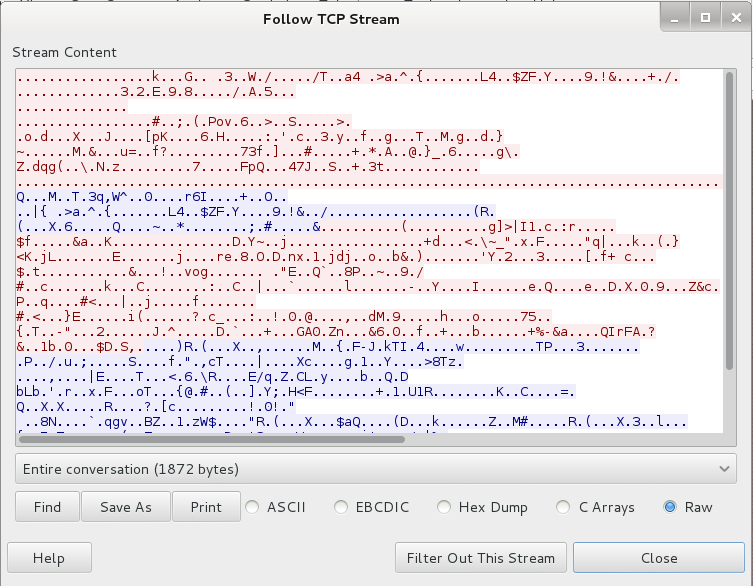

# Introduction

## Differences between Clear Text, Cryptography Protocols & VPNs

Clear-text:

* Easy to intercept, eavesdrop & mangle.
* Use clear-text only on trusted networks.

Cryptographic Protocols:

* Protocol encrypts information transmitted to protect the communication.
* Prevents eavesdropping.
* Need to transmit clear-text anyways? Wrap your communication into a **tunnel**.
* Protocol for Tunneling = VPN.

VPN:

* A VPN uses cryptography to extend a private network over a public one.
* Protected connection a to a a private network.
* A VPN connection is needed for using the course Labs.

## HTTP\(s\) Traffic Sniffing with Wireshark

There are **2** websites using **HTTP** and **HTTPS** respectively, differences in the communication can be checked through a sniffer as Wireshark and using the command 'Follow TCP Stream':

 

## Basic Binary and Hexadecimal Arithmetic

### Binary

> `1 + 1 = 10`
>
> `111 + 1 = 1000`
>
> `1101b` = `13d`

### **Converting Decimal and to Binary**

Divide by 2 and keep a not of the remainder iterating the same operation until the dividend is zero.

`13d` is `1011b`:

| Step | Operation | Remainder |
| :--- | :--- | ---: |
| 1 | 13 / 2 = 6 | 1 |
| 2 | 6 / 2 = 3 | 0 |
| 3 | 2 / 2 = 1 | 1 |
| 4 | 1 / 2 = 0 | 1 |

### **Binary Operators**

| Name | Description | Example |
| :--- | :--- | :--- |
| `NOT` | Negation | `NOT 1101` = `0010` |
| `AND` | if \(both bits in the comparing position are ones\) -&gt; 1; else 0 | `1001 AND 1100` = `1000` |
| `OR` | if \(at least one of the bits is one\) -&gt; 1; else 0 | `1001 OR 1100` = `1101` |
| `XOR` | if \(**just one** of the bits is one\) -&gt; 1; else 0 | `1001 XOR 1100` = `0101` |

### Hexadecimal

|  |  |  |  |  |  |  |  |  |  |  |  |  |  |  |  |  |
| :--- | :--- | :--- | :--- | :--- | :--- | :--- | :--- | :--- | :--- | :--- | :--- | :--- | :--- | :--- | :--- | :--- |
| Hex | 0 | 1 | 2 | 3 | 4 | 5 | 6 | 7 | 8 | 9 | A | B | C | D | E | F |
| Dec | 0 | 1 | 2 | 3 | 4 | 5 | 6 | 7 | 8 | 9 | 10 | 11 | 12 | 13 | 14 | 15 |

`0x3a1` = `3a1h` = `929d`

| Conversion | Operation | Total |
| :--- | :--- | ---: |
| 3 = 3 | 3 \* 16^2 | 768 |
| a = 10 | 10 \* 16^1 | 160 |
| 1 = 1 | 1 \* 16^0 | 1 |

### **Converting decimal to hexadecimal**

Similar to converting decimal to binary: `1019d` = `0x3FB`

| Number/16 | Result | Reminder \* 16 |
| :--- | :--- | :--- |
| 1019 / 16 | 63.6875 | 0.6875 \* 16 = 11 \(B\) |
| 63 / 16 | 3.9375 | 0.9375 \* 16 = 15 \(F\) |
| 3 / 16 | 0.1875 | 0.1875 \* 16 = 3 |
| 0 / 16 | -- |  |

