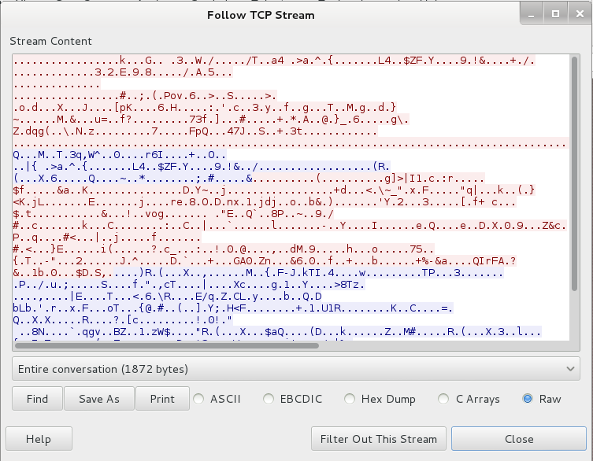
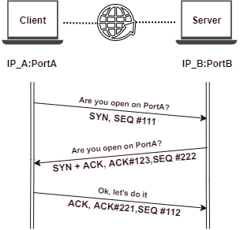

# Penetration Testing Prerequisites

* [Introduction](1of3-penetration-testing-prerequisites.md#introduction)
  * [Differences between Clear Text, Cryptography Protocols & VPNs](1of3-penetration-testing-prerequisites.md#differences-between-clear-text-cryptography-protocols--vpns)
  * [HTTP\(s\) Traffic Sniffing with Wireshark](1of3-penetration-testing-prerequisites.md#https-traffic-sniffing-with-wireshark)
  * [Basic Binary and Hexadecimal Arithmetic](1of3-penetration-testing-prerequisites.md#basic-binary-and-hexadecimal-arithmetic)
    * [Binary](1of3-penetration-testing-prerequisites.md#binary)
    * [Hexadecimal](1of3-penetration-testing-prerequisites.md#hexadecimal)
* [Networking](1of3-penetration-testing-prerequisites.md#networking)
  * [Protocols](1of3-penetration-testing-prerequisites.md#protocols)
    * [Protocol Layers](1of3-penetration-testing-prerequisites.md#protocol-layers)
    * [IPv4](1of3-penetration-testing-prerequisites.md#ipv4)
    * [IPv6](1of3-penetration-testing-prerequisites.md#ipv6)
  * [Routing](1of3-penetration-testing-prerequisites.md#routing)
  * [Hubs/Switches & Protocols](1of3-penetration-testing-prerequisites.md#hubsswitches--protocols)
    * [MAC addresses](1of3-penetration-testing-prerequisites.md#mac-addresses)
  * [TCP & UDP & Ports](1of3-penetration-testing-prerequisites.md#tcp--udp--ports)
    * [TCP 3-way handshake](1of3-penetration-testing-prerequisites.md#tcp-3-way-handshake)
  * [Firewall & Network Defense](1of3-penetration-testing-prerequisites.md#firewall--network-defense)
    * [IDS / Intrusion Detection Systems](1of3-penetration-testing-prerequisites.md#ids--intrusion-detection-systems)
    * [IPS](1of3-penetration-testing-prerequisites.md#ips)
    * [Stop on Obstacle](1of3-penetration-testing-prerequisites.md#stop-on-obstacle)
  * [LAB: Find the Secret Server](1of3-penetration-testing-prerequisites.md#lab-find-the-secret-server)
  * [DNS](1of3-penetration-testing-prerequisites.md#dns)
    * [DNS Resolution Algorithm](1of3-penetration-testing-prerequisites.md#dns-resolution-algorithm)
    * [Resolvers and Root servers](1of3-penetration-testing-prerequisites.md#resolvers-and-root-servers)
    * [Reverse DNS Resolution](1of3-penetration-testing-prerequisites.md#reverse-dns-resolution)
  * [Wireshark](1of3-penetration-testing-prerequisites.md#wireshark)
* [Web Applications](1of3-penetration-testing-prerequisites.md#web-applications)
  * [HTTP Protocol Basics](1of3-penetration-testing-prerequisites.md#http-protocol-basics)
    * [HTTPS: HTTP over SSL/TLS as an encryption layer](1of3-penetration-testing-prerequisites.md#https-http-over-ssltls-as-an-encryption-layer)
    * [Tools](1of3-penetration-testing-prerequisites.md#tools)
  * [HTTP Cookies \(1994 - Netscape\)](1of3-penetration-testing-prerequisites.md#http-cookies-1994---netscape)
  * [Sessions](1of3-penetration-testing-prerequisites.md#sessions)
    * [Session cookies](1of3-penetration-testing-prerequisites.md#session-cookies)
  * [Same Origin Policy \(SOP\)](1of3-penetration-testing-prerequisites.md#same-origin-policy-sop)
  * [Burp Suite](1of3-penetration-testing-prerequisites.md#burp-suite)
* [Penetration Testing](1of3-penetration-testing-prerequisites.md#penetration-testing)
  * [Penetration Testing Introduction](1of3-penetration-testing-prerequisites.md#penetration-testing-introduction)
  * [Lifecycle of a Penetration Tester](1of3-penetration-testing-prerequisites.md#lifecycle-of-a-penetration-tester)
    * [Engagement](1of3-penetration-testing-prerequisites.md#engagement)
    * [Information Gathering](1of3-penetration-testing-prerequisites.md#information-gathering)
    * [Footprinting and Scanning](1of3-penetration-testing-prerequisites.md#footprinting-and-scanning)
    * [Vulnerability Assessment](1of3-penetration-testing-prerequisites.md#vulnerability-assessment)
    * [Exploitation](1of3-penetration-testing-prerequisites.md#exploitation)
    * [Reporting](1of3-penetration-testing-prerequisites.md#reporting)

## Introduction

The term 'hacker' \(person who is curious, highly intelligent, starving for knowledge\) was born in the 60s \(MIT Community\).

Career opportunities:

* Need of protecting sensitive information.
* Wide range of cyber-threats.
* IT Security is a difficult game.
* Pentesters, simulate hacks against a network, computer system, webapp or organization using the same techniques as malicious criminals.
* Demand is in growth.

### Differences between Clear Text, Cryptography Protocols & VPNs

Clear-text:

* Easy to intercept, eavesdrop & mangle.
* Use clear-text only on trusted networks.

Cryptographic Protocols:

* Protocol encrypts information transmitted to protect the communication.
* Prevents eavesdropping.
* Need to transmit clear-text anyways? Wrap your communication into a **tunnel**.
* Protocol for Tunneling = VPN.

VPN:

* A VPN uses cryptography to extend a private network over a public one.
* Protected connection a to a a private network.
* A VPN connection is needed for using the course Labs.

### HTTP\(s\) Traffic Sniffing with Wireshark

There are **2** websites using **HTTP** and **HTTPS** respectively, differences in the communication can be checked through a sniffer as Wireshark and using the command 'Follow TCP Stream':

 

### Basic Binary and Hexadecimal Arithmetic

#### Binary

> `1 + 1 = 10`
>
> `111 + 1 = 1000`
>
> `1101b` = `13d`

**Converting Decimal and to Binary**

Divide by 2 and keep a not of the remainder iterating the same operation until the dividend is zero.

`13d` is `1011b`:

| Step | Operation | Remainder |
| :--- | :--- | ---: |
| 1 | 13 / 2 = 6 | 1 |
| 2 | 6 / 2 = 3 | 0 |
| 3 | 2 / 2 = 1 | 1 |
| 4 | 1 / 2 = 0 | 1 |

**Binary Operators**

| Name | Description | Example |
| :--- | :--- | :--- |
| `NOT` | Negation | `NOT 1101` = `0010` |
| `AND` | if \(both bits in the comparing position are ones\) -&gt; 1; else 0 | `1001 AND 1100` = `1000` |
| `OR` | if \(at least one of the bits is one\) -&gt; 1; else 0 | `1001 OR 1100` = `1101` |
| `XOR` | if \(**just one** of the bits is one\) -&gt; 1; else 0 | `1001 XOR 1100` = `0101` |

#### Hexadecimal

|  |  |  |  |  |  |  |  |  |  |  |  |  |  |  |  |  |
| :--- | :--- | :--- | :--- | :--- | :--- | :--- | :--- | :--- | :--- | :--- | :--- | :--- | :--- | :--- | :--- | :--- |
| Hex | 0 | 1 | 2 | 3 | 4 | 5 | 6 | 7 | 8 | 9 | A | B | C | D | E | F |
| Dec | 0 | 1 | 2 | 3 | 4 | 5 | 6 | 7 | 8 | 9 | 10 | 11 | 12 | 13 | 14 | 15 |

`0x3a1` = `3a1h` = `929d`

| Conversion | Operation | Total |
| :--- | :--- | ---: |
| 3 = 3 | 3 \* 16^2 | 768 |
| a = 10 | 10 \* 16^1 | 160 |
| 1 = 1 | 1 \* 16^0 | 1 |

**Converting decimal to hexadecimal**

Similar to converting decimal to binary: `1019d` = `0x3FB`

| Number/16 | Result | Reminder \* 16 |
| :--- | :--- | :--- |
| 1019 / 16 | 63.6875 | 0.6875 \* 16 = 11 \(B\) |
| 63 / 16 | 3.9375 | 0.9375 \* 16 = 15 \(F\) |
| 3 / 16 | 0.1875 | 0.1875 \* 16 = 3 |
| 0 / 16 | -- |  |

## Networking

### Protocols

IP protocol header is 160bits \(20Bytes\):

* First 4 bits: IP version.
* Source Address: 32 bits \(starting at position 96\).
* Destination Address: just right after.


#### Protocol Layers

* During **encapsulation**, every protocol adds its own header to the packet, treating it as a payload.
* The receiving host does the same operation in reverse order. Using this method, the application does not need to worry about how the transport, network and link layers work. It just hands in the packet to the transport layer.

| TCP/IP | ISO/OSI |
| :--- | :--- |
| Application   Transport   Network   Physical | Application   Presentation   Session   Transport   Network   Link   Physical |

#### IPv4

* Internet Protocol is the protocol that runs on the Internet layer of the Internet Protocol Suite, also known as TCP/IP.
* IP delivers datagrams \(IP packets\) to rest of hosts, using IP addresses to identify them.
* IPv4 addresses = 4 bytes.
* To fully identify a host, you also need to know its network: IP address + Subnet Mask.
* To fully identify the network part you have to perform a bitwise AND operation between the netmask and the IP address.

| Reserved IPv4 addresses | Purpose |
| :--- | :--- |
| 0.0.0.0 - 0.255.255.255 | This network |
| 127.0.0.0 - 127.255.255.255 | Local host |
| 192.168.0.0 - 192.168.255.255 | Private Networks |

Example:

|  | Decimal | Binary |
| :--- | :--- | :--- |
| Host IP Address | 192.168.33.12 | 11000000.10101000.00100001.00001100 |
| Mask | 255.255.224.0 | 11111111.11111111.11100000.00000000 |
| **Network** | 192.168.32.0\(/19\) | 11000000.10101000.00100000.00000000 |
| NOT Mask | 255.255.224.0 | 00000000.00000000.00011111.11111111 |
| Host Part 'IP' AND 'NOT Mask' | 0.0.1.12 | 00000000.00000000.00000001.00001100 |

> 13 bits to represent hosts =&gt; 2^13 = **8192** different addresses - 2 \(network and broadcast\)
>
> * **Network**: one with the host part made by all zeros
> * **Broadcast**: another with the host part made by all ones

#### IPv6

* 16bit hexadecimal numbers separated by a colon \(:\).
* Regular Form: `2001:0db8:0020:130F:0000:0000:097C:130B`.
* Compressed Form: `FF01:0:0:0:0:0:0:43` =&gt; `FF01::43`.
* IP v4-compatible: `0:0:0:0:0:0:13.1.68.3` =&gt; `::13.1.68.3`.
* Reserved addresses:
  * Loopback: `::1/128`.
  * IPv4 mapped addresses: `::FFFF:0:0/96`.
* IPv6 addresses can be split in half \(64bits/each part\).
  * _Network part_: Last 16 bits can be used only for specifying a subnet.
  * _Device part_: or Interface ID.
* IPv6 Scope
  * _Global Unicast Address_: scope internet - routed on internet
  * _Unique Local_: scope internal network or VPN - internally routable but not routed on Internet
  * _Link Local_: scope network link - not routed internally nor externally

IPv6 Subnetting:

| Prefix \(First 64 bits\) | Host \(Last 64\) |
| :---: | :---: |
| Internet Global Addressing \(48bits\) + Subnets \(16 bits\) | Device/Interface ID |

### Routing

**Routers** are devices connected to different networks at the same time, forwarding IP datagrams from one network to another.

* Routing protocols are used to determine the best path to reach a network. They behave like a postman who tries to use the shortest path possible to deliver a letter.
* A router inspects the destination address of every incoming packet and then forwards it through one of its interfaces.

Routing Table:

* To choose the right forwarding interface, a router performs a lookup in the routing table, where it finds an IP-to-interface binding.
* The table can also contain an entry with the default address \(0.0.0.0\). This entry is used when the router receives a packet whose destination is an _unknown network_.

Metrics:

* Routing protocols also assign a metric to each link.
* This ensures that, if two paths have the same number of hops, the fastest route is selected.
* The metric is selected according to the channel's estimated bandwidth and congestion.

Checking the routing table:

| OS | Command |
| :--- | :--- |
| Linux | `ip route` |
| Windows | `route print` |
| Mac OS X | `netstat -r` |

### Hubs/Switches & Protocols

* Hubs/Switches are network devices that forward frames on a local network.
* They work with link layer network addresses: **MAC addresses**.
* Link layer protocols and devices only deal with the next hop.

#### MAC addresses

* Uniquely identify a network card on the Layer 2.
* It's also known as physical address.
* 48 bits = 6 bytes, expressed in hexadecimal \(Ex: `00:11:AA:22:EE:FF`\).
* Every host has a MAC and an IP address.

Discovery of MAC addresses:

| OS | Command |
| :--- | :--- |
| Windows | `ipconfig /all` |
| \*nix/Mac OS X | `ipconfig` |
| Linux | `ip addr` |

**Communication between Workstation A and Workstation B via a Router:**

* The router will not change the source and destination IP addresses.
* Whenever a _device sends a packet_:
  * `Destination MAC address = MAC address of the next hop` \(this ensures the network knows where to forward the packet\).
  * `Destination IP address = Destination Host address` \(this is global info and remains the same along the packet trip\).
* Broadcast MAC address: `FF:FF:FF:FF:FF:FF` \(a frame with this address is delivered to all the hosts in the local network\).

| Field | `Workstation A` | `Router` |
| :--- | :--- | :--- |
| Destination IP address | `Workstation B` | `Workstation B` |
| Destination MAC address | `Router` | `Workstation B` |
| Source IP address | `Workstation A` | `Workstation A` |
| Source MAC address | `Workstation A` | `Router` |

**Hubs**

* Predecessor of switches, same purpose, different functionality.
* Repeaters and do not check any header.
* They simply forward packets by repeating same electric signals on every port.
* Every host receives the same packets.

**Switches**

_Routers_ work with _IP addresses_. _Switches_ work with _MAC addresses_:

* They can have multiple interfaces.
* Different speeds: from 10Mbps to 10Gbps, being 1Gbps the standard.

_CAM Table / Forwarding table_: Stored in the device's RAM.

* Binds MAC addresses to interfaces.
* Contains: MAC address, Interface & TTL.
* TTL determines how long an entry will stay in the table, CAM table has a finite size, as soon as an entry expires it is removed from the table.
* There might be multiple hosts on the same interface and interfaces without any host attached.
* Switches learn new MAC addresses dynamically, inspecting the header of every packet they receive, thus identifying new hosts.
* While routers use complex routing protocols to update their routing rules, switches just use the source MAC address of the packets they process to decide which interface to use when forwarding a packet.
* _CAM Table Population_, the source MAC address is compared to the CAM table:
  * If the _MAC address is not_ in the table, the switch will add a new _MAC-interface_ binding to the table.
  * If the _MAC is_ already in the table, its TTL gets updated.
  * If the _MAC is in the table but bound to another interface_, the switch will update the table.
* To **forward a packet**:
  * The switch reads the destination MAC address of the frame.
  * Performs a look-up in the CAM table.
  * It forwards the packet to the corresponding interface.
  * If there's no entry for that MAC address, the switch will forward the frame to all its interfaces.

Example of a CAM Table:

| MAC | Interface | TTL | Description |
| :--- | :--- | :--- | :--- |
| MAC\#1 | 1 | 30 | A single host is attached to Interface 1. |
| MAC\#2 | 2 | 5 | Two hosts are attached to Interface 2, probably via another switch. |
| MAC\#3 | 2 | 5 | Two hosts are attached to Interface 2, probably via another switch. |
| MAC\#4 | 3 | 7 | A single host is attached to Interface 3. |
|  |  |  | Interface 4 has no hosts attached. |

**ARP: Host\#A sends a packet Host\#B**

`Host#A` needs to know IP/MAC addresses of `Host#B`. If `Host#A` knows `Host#B`'s IP but not MAC:

1. `Host#A` builds an ARP request containing the `Host#B`'s IP and `FF:FF:FF:FF:FF:FF` as destination MAC address.
2. Every host will receive the request. A host discards an entry at the power off or when the entry's TTL expires.
3. Only `Host#B` will ARP reply to it, telling `Host#A` its MAC address.
4. `Host#A` will save the IP-MAC binding in its ARP cache.

| OS | Command |
| :--- | :--- |
| `arp -a` | Windows |
| `arp` | \*nix OS |
| `ip neighbour` | Linux |

### TCP & UDP & Ports

| TCP: Transmission Control Protocol | UDP: User Datagram Protocol |
| :--- | :--- |
| Guarantees packet delivery | Does not guarantee packet delivery |
| Connection oriented | It's connectionless |
| Vast majority of applications use it | Faster that TCP, better throughput |
| Lower throughput than UDP | Multimedia applications |

* `<IP>`:`<Port>`: identify a single network process on a machine.
* Server and Clients know what port to use as it's expressed in the source/destination ports in the TCP/UDP header.
* There are 1024 well-known ports: 0-1023.

|  |  |  |  |
| :--- | :--- | :--- | :--- |
| SMTP | 25 | SFTP | 115 |
| SSH | 22 | Telnet | 23 |
| POP3 | 110 | FTP | 21 |
| IMAP | 143 | RDP | 3389 |
| HTTP | 80 | MySQL | 3306 |
| HTTPS | 443 | MS SQL Server | 1433 |
| NetBIOS | 137, 138, 139 |  |  |

Check _listening ports_ and _current TCP connections_ as information about the processes listening on the machine and processes connecting to remote servers:

| OS | Command |
| :--- | :--- |
| Windows | `netstat -ano` |
| Linux | `netstat -tunp` |
| Mac OS X | `netstat -p tcp -p udp` together with `lsof -n -i4TCP -i4UDP` |

#### TCP 3-way handshake



TCP is connection oriented. The header fields involved in the handshake are:

* Sequence number
* Acknowledgement numbers
* SYN & ACK flags
* Host -&gt; SYN -&gt; Server
  * SYN flag enabled
  * Random sequence number
* Host &lt;- SYN-ACK &lt;- Server
  * SYN & ACK flags enabled
  * Random sequence number
* Host -&gt; ACK -&gt; Server
  * Client completes the synchronization by sending an ACK packet

### Firewall & Network Defense

Firewalls functions:

* **Filter packets coming in and out of a network**:
  * Headers are inspected, but they don't give any information on the actual packet content.
  * Admin can crate rules according to certain characteristics: Source IP / Destination IP, Source Port / Destination Port, Protocol.
  * Packet inspection actions: Allow, Drop, Deny \(same as drop but notifying the source host\)
  * Packet filtering isn't enough to stop layer 7 attacks \(application layer, as XSS, BoF, SQL injection or much more\)
* **Access Control** to network resources and services \(network 2 network too\):
  * _NAT \(Network Address Translations\)_: rewrites source IP addresses of every packet.
  * _IP Masquerading_: masquerading the original client's IP address.
* Can **work on different layers of the OSI model**, filter unwanted traffic inspecting content \(not just headers\).

#### IDS / Intrusion Detection Systems

* They inspect the application payload trying to detect any potential attack.
* They detect ongoing intrusions, attack vectors, ping sweeps, port scans, SQL injections, BoFs, etc.
* Can also identify traffic generated by a virus or worm by means of **signatures**.
* IDS cannot detect something _if it doesn't already know before hand_.
* _False positive_: legit traffic is flagged as malicious.
* Detection is performed by a multitude of sensors.
* IDS Manager: software is in charge of maintaining policies and providing a management console to the sysadmin.
* IDS **is not** a firewall substitute.

| 2 types | Description |
| :--- | :--- |
| NIDS: network | - Inspects network traffic with sensors   - Usually placed on a router or in a network with high intrusion risk \(as DMZ\) |
| HIDS: host | - Monitors app logs, file-system changes or OS changes |

#### IPS

* IDS can detect, activity is logged but the activity isn't blocked
* IPS drops malicious requests when a threat has a risk classification above a pre-define threshold

#### Stop on Obstacle

When an environmental constraint \(FW/IDS/other device\) is in place:

* TCP SYN are sent, but there's no TCP SYN/ACK reply
* TCP SYN are sent, but a TCP RST/ACK is received

### LAB: Find the Secret Server

The is to configure your VPN lab environment in order to reach every webserver. Given you are connected through VPN to a target organization where:

* `10.175.34.0/24` is the VPN network for your PC.
* `172.16.88.81` is a webserver inside the `172.16.88.0/24` network.
* `192.168.241.12`  is a webserver inside the `192.168.241.0/24` network.
* `192.168.222.199`  is a webserver inside the `192.168.222.0/24` network.

Knowing the info above, we just need to add one more route in order to access the `192.168.222.0/24` network. We'll do that through our gateway `10.175.34.1`:

```bash
> ip route add 192.168.222.0/24 via 10.175.34.1
> route
Kernel IP routing table
Destination     Gateway         Genmask         Flags Metric Ref    Use Iface
default         liveboxfibra.ho 0.0.0.0         UG    100    0        0 eth0
10.175.34.0     0.0.0.0         255.255.255.0   U     0      0        0 tap0
172.16.88.0     10.175.34.1     255.255.255.0   UG    0      0        0 tap0
192.168.1.0     0.0.0.0         255.255.255.0   U     100    0        0 eth0
192.168.222.0   10.175.34.1     255.255.255.0   UG    0      0        0 tap0
192.168.241.0   10.175.34.1     255.255.255.0   UG    0      0        0 tap0
```

### DNS

* SSL/TLS certifications validation relies on DNS.
* DNS is an application layer protocol

Structure/Hierarchy of a DNS Name \(www.sub.domain.com\).

| Host | Subdomain | Domain Part | Top level domain |
| :--- | :--- | :--- | :--- |
| www | sub | domain | com |

#### DNS Resolution Algorithm

Resolvers are DNS servers provided by your ISP or publicly available: they convert a DNS name into an IP address.

1. The resolver contacts one of the root name servers, these serves contain information about the top-level domains.
2. It asks the TLD name server what's the name server that can give information \(authoritative name server\) about the domain the resolver is looking for.
3. If there are one or more subdomains, step 2 is performed again on the authoritative DNS server for every subdomain.
4. The resolver asks for the name resolution of the host part.

#### Resolvers and Root servers

* IP addresses of the root servers are hardcoded in the configuration of the resolver.
* Sysadmins keep the list updated, otherwise, the resolver would not be able to contact a root server.

#### Reverse DNS Resolution

* DNS can perform the inverse operation: convert an IP into a DNS name.
* The admin of a domain must enable this feature for a domain to make it work.
* `ping` utility performs a reverse DNS query after receiving every response from the target.

### Wireshark

* Can capture all the traffic seen by the network card of the computer running it.
* NIC \(Network Interface Cards\) need to work in promiscuous or monitor mode.
  * Instead of discarding any packet addressed to another NIC, in promiscuous mode a network card will accept and process **any** packet.
  * Just like it would happen in a hub network.
  * In switched networks, you have to perform an attack such as ARP poisoning or MAC flooding in order to do that.
  * WiFi medium is broadcast by nature.

Some filters:

* No ARP and no DNS: `not arp and !(udp.port == 53)`.
* Only ICMP: `icmp`.
* All HTTP GET request: `http.request.method == GET`.
* `tcp.stream eq 1`

Be able to filter:

* Filter one protocol
* Identify 3 way handshake
* Filter http traffic
* Filter ICMP

## Web Applications

* The web app world is extremely heterogeneous. Every web application is different from others because developers have many ways to accomplish the same task.
* Having flexibility in web app development also means having flexibility in creating insecure code.
* Fundamental aspects: HTTP protocol basics, Cookies, Sessions, Same Origin Policy.

### HTTP Protocol Basics

HTTP works on top of TCP protocol, so when the connection is established, the client sends a request and waits for the answer. The server processes the request and sends back its answer, along with status code and data:

* Client -&gt; HTTP request -&gt; Server
* Client &lt;- HTTP response &lt;- Server

HTTP Connection establishment:

* Client -&gt; SYN -&gt; Server
* Client &lt;- SYN/ACK &lt;- Server
* Client -&gt; ACK + GET /html -&gt; Server
* Client &lt;- HTML response + Close connection &lt;- Server

The format of an HTTP message is:

```text
Headers\r\n
\r\n
Message Body\r\n
```

where:

```text
\r # carriage return
\n newline
```

Verbs: PUT, TRACE, HEAD, POST.

Some status codes:

| Status code | Meaning |
| :--- | :--- |
| 200 OK | the resource is found |
| 301 Moved Permanently | the requested resource has been assigned a new permanent URI |
| 302 Found | the resource is temporarily under another URI |
| 403 Forbidden | the client doesn't have enough privileges, server refuses req. |
| 404 Not Found | the server cannot find the resource matching the request |
| 500 Internal Server Error | the server does not support the functionality required |

Request example:

```bash
GET / HTTP/1.1                                    # VERB path protocol version
Host: www.elarnsecurity.com                       # Specifies the internet hostname and port number, obtained from the URI of the resource
User-Agent: Mozilla/5.0 (X11; Linux x86_64 ...)   # Tells the server what client software is issuing the request
Accept: text/html                                 # Specifies which document type is expected in the response
Accept-Language: en-US,en;q=0.5                   # Browser can as for a specific human language in the response
Accept-Encoding: gzip, deflate                    # Restricts the content encoding
Connection: keep-alive                            # Future communications with the server will reuse the current connection
\r\n\r\n
< PAGE CONTENT > ...
```

Response example:

```bash
HTTP/1.1 200 OK                                   # Status-Line: protocol version + status code + textual meaning
Date: Wed, 19 Nov 2020 10:10:10 GNT               # Time at which the message was originated
Cache-Control: private, max-age=0                 # Using cached content saves bandwidth
Content-Type: text/html; charset=UTF=8            # Lets the client know how to interpret the body of the message
Content-Encoding: gzip                            # The message body is compressed with gzip
Server: Apache/2.2.15 (CentOS)                    # (optional) header of the server that generated the content
Content-Length: 99043                             # length in bytes of the message body


< PAGE CONTENT > ...
```

#### HTTPS: HTTP over SSL/TLS as an encryption layer

HTTPS: _HTTP over SSL/TLS_ is a method to run HTTP which is a clear-text protocol over SSL/TLS, a cryptographic protocol:

* Provides: Confidentiality, Integrity Protection and Authentication to the HTTP protocol.
* An attacker cannot neither sniff the application layer communication nor alter the application layer data.
* Traffic can be sniffed, but any adjacent user will not know request/response headers, request/response body, request target domain.
* The client can tell the _real identity of the server_ and, sometimes, vice-versa.
* When inspecting HTTPS, one cannot know what domain is contacted and what data is exchanged.
* HTTPS does not protect against web application flaws.
* All the attacks against an application happen regardless of SSL/TLS, such as XSS and SQL injection will still work.

#### Tools

`netcat` opens a raw connection to a service port:

```bash
$ nc -v www.ferrari.com 80

...
GET / HTTP/1.1
Host: www.ferrari.com # 2 lines after inputting this line

...
HEAD / HTTP/1.1
Host: www.ferrari.com

...
HEAD /en_en/ HTTP/1.1
Host: www.ferrari.com
```

```bash
$ nc -v hack.me 443

GET / HTTP/1.1
Host: hack.me

# Nothing is displayed as netcat cannot open SSL websites
```

```bash
$ openssl s_client -connect hack.me:443
$ openssl s_client -connect hack.me:443 -debug
$ openssl s_client -connect hack.me:443 -state
$ openssl s_client -connect hack.me:443 -quiet

# Certificate is spat out

GET / HTTP/1.1
Host: hack.me


OPTIONS / HTTP/1.1
Host: hack.me
```

`Burp Suite` repeater tool also allows same operation in order to inspect raw response given a HTTP verb. It can also configure a HTTPS connection right away.

### HTTP Cookies \(1994 - Netscape\)

* HTTP is a stateless protocol, therefore HTTP cannot keep the state of a visit across different HTTP requests.
* HTTP requests are unrelated to the preceding and following ones.
* Often exploits rely on stealing cookies: Cookies / Cookie jar, just textual information installed by a website into a web browser.

A server can set a cookie via `Set-Cookie` HTTP header field in a response message:

```text
HTTP/1.1 200 OK
Date: Wed, 19 Nov 2020 10:10:10 GNT
Cache-Control: private, max-age=0
Content-Type: text/html; charset=UTF=8
Content-Encoding: gzip
Server: Apache/2.2.15 (CentOS)
Set-Cookie: ID=Value; expires=Thu, 21-May-2015 15:25:20 GMT; path=/; domain=.example.site; Http
Content-Length: 99043


< PAGE CONTENT > ...
```

**Cookie format**

A cookie contains the following attributes: the actual content, an expiration date, path, domain and optional flags \(Http only flag, Secure flag\).

| Field | Value |
| :--- | :--- |
| Cookie Content | ID=Value; |
| Expiration Date | expires=Thu, 21-May-2015 15:25:20 GMT; |
| Path | path=/; |
| Domain | domain=.example.site |
| Flag-setting Attribute | HttpOnly |

* Browsers use domain, path, expires and flags attributes to choose whether or not to send a cookie in request.
* Cookies are sent only to the valid domain/path when they are not expired and according to their flags.
* The domain field and the path field set the scope of the cookie.
* The browser sends the cookie only if the request is for the right domain.
* When a web server installs a cookie, it sets the domain field.
* Then the browser will use the cookie for every request sent to that domain and _all its subdomains_.
* If the server does not specify the domain attribute, the browser will automatically set the domain as the server domain and set the cookie 'host-only' flag,meaning that this cookie will be sent only to that precise hostname.
* Respectively, when a cookie has the path attribute set, the browser will send the cookie to the right domain and to the resources in that path _and not any other_.
* A browser will not send an expired cookie to the server, session cookies will expire with the HTTP session.
* `http-only` flag is a mechanism that prevents JavaScript or any other non-HTML technology from reading the cookie \(preventing a XSS robbery\).
* `Secure` flag creates secure cookies that will only be sent over an HTTPS connection.

### Sessions

Sessions are a mechanism that lets the website store variables specific for a given visit on the server side:

* Sometimes the web developer prefers to store some information on the server side.
* This avoids the back and forth data transmission and hides the application logic.
* Each session is identified by a session id, where the client presents this ID for each subsequent request.
* With that ID, the server is able to retrieve the state of the client.

#### Session cookies

Session cookies allow to install a session ID on a web browser

```bash
SESSION=0mwerj234w
PHPSESSID=1992maiwr2H     # PHP
JSESSIONID=W8234mSfsw3    # JSP
```

* The browser then uses the cookie in subsequent requests.
* A session could contain multiple variables, so sending a small cookie keeps the bandwidth usage low.
* The browser will send back the cookie according to the cookie protocol,thus sending the session ID.
* Session IDs can also be transmitted via GET requests.

Session cookies and Cookies can be inspected and manipulated via Firebug for Firefox or any other web developer tools. Your session will be forwarded to re-authenticate if you delete the session cookie after login process.

```javascript
// If HttpOnly isn't enabled, we'd be able to access the cookie jar from JavaScript
document.cookie
```

### Same Origin Policy \(SOP\)

* SOP / Same Origin Policy is a critical point of web application security.
* Prevents JavaScript code from getting/setting properties on a resource coming from a different origin.
* To determine if JS can access a resource, hostname, port and protocol _must match_.
* SOP only applies to the actual code of a script.
* It is still possible to include external resources by using HTML, like IMG, script, iFrame...
* If a script on Domain A was able to read content on Domain B, it would be possible to steal clients' information and mount a number of dangerous attacks.

### Burp Suite

* Any web application contains many objects like scripts, images, stylesheets, client and server-side intelligence.
* Having tools that help in the study and analysis of web application behavior is critical.
* An _intercepting proxy_ is a tool that lets you analyze and modify any request and any response exchanged between an HTTP client and a server.
* Intercepting proxy != web proxy \(as Squid\)

BurpSuite will let you:

* Intercept request/responses between your browser and web server.
* Build requests manually.
* Crawl a website by automatically visiting every page in a website.
* Fuzz webapps by sending them patterns of a valid and invalid inputs to test their behavior.
* You can modify the header and the body of a message by hand or automatically.
* Burp Repeater lets you manually build raw HTTP requests.
* Same can be achieved with `nc` or `telnet`.

Options:

* Proxy: let's you view, intercept and modify traffic between browser/
* Spider: web crawler.
* Repeater: manipulate and reissue HTTP requests.
* Learn how to find hidden resources on web application.
* Learn how to configure your browser's proxy to work with Burp Suite, apart of setting 'scope'.

## Penetration Testing

### Penetration Testing Introduction

* A penetration tester performs a deep investigation of a remote system's security flaws.
* Penetration testers must test for any and all vulnerabilities, not just the ones that may grant them root access.
* Penetration testing is not about getting `root`!
* Penetration testers cannot destroy their client's infrastructure, professional pentesting requires a thorough understanding of attack vectors and their potential.

### Lifecycle of a Penetration Tester

* Pentester activity must guarantee that the least impact possible on the production systems and services.
* Avoid overloading client's systems and networks.
* Communicate to client what steps to take, just in case anything goes wrong during the pentest.
* Pentesting is a process that ensures that every potential vulnerability or security weakness gets tested with the lowest possible overhead.

#### Engagement

Details about the pentest are established during the Engagement phase.

Quotation:

* Fee establishment for the job to be accomplished.
* Fee will vary according to:
  * Type of engagement: black box, gray box, etc.
  * How time-consuming the engagement is.
  * The complexity of the applications and services in scope.
  * The number of targets \(IP addresses, domains, etc.\)
* Evaluation and quoting these aspects requires experience.
* If you are not able to quantify the amount of work required by an engagement, you can provide an hourly fee.

Proposal Submittal:

* The best way to win a job is by providing a sound and targeted proposal.
* You should write the proposal keeping in mind the client's needs and infrastructure.
* Must include:
  * Your understanding of the customer's requirements.
  * Approach & Methodology
    * Automated scanning tools
    * Manual testing
    * Onsite testing
    * Any other
  * Value the pentest will bring to business
  * Risks & Benefits
    * Business continuity
    * Improved confidentiality
    * Avoidance of money and reputation loss
  * Estimate of the time / price
  * Type:
    * Penetration test
    * Vulnerability assessment
    * Remote / Onsite
  * Scope
    * IP addresses
    * Network blocks
    * Domain names
    * Etc.

Scope:

* Make sure that the target of your engagement is the property of your client.
* Shared hosting: You must not conduct an assessment on targets unless you are given written permission from the hosting provider.
* Check country laws

Incident Handling:

* Unplanned and unwanted situation that affects the client's environment and disrupts its services.
* Even when sticking to best practices,there's a possibility to damage the tested assets.
* Aim not to damage the target.
* In case of planning some insensitive or risk test, communicate with the customer.
* Have a 'Incident Handling Procedure':
  * Set of instructions that need to be executed by both you and your customer on how to proceed when a incident occurs.
  * Have an emergency contact.
  * Add an statement to the rules of engagement.

Legal work:

* Sometimes you will need to involve a lawyer as information security laws vary a lot from country to country
* Sometimes a professional insurance is required
* NDA can be signed. Keep data private and encrypted on your PC.
* Outline what you can and you cannot do.
* Rules of engagement is another document that will define the scope of engagement and will put on paper what you are entitled to do and when, this includes the time window for your tests and your contacts in the client's organizations

#### Information Gathering

* Fundamental stage for a successful penetration test.
* Starts once the legal paperwork is complete, and not before.
* You investigate and harvest info about the client's company

Extremely useful information if Social Engineering is allowed by the rules of the engagement:

* Emails and addresses
  * Board of directors
  * Investors
  * Managers and employees
* Branch location and addresses
* Identify risks in the client's critical infrastructure.
* Having an understanding of the business is a key aspect in understanding what is important for your client.
* Understanding the business allows us to rate the risks associated with a successful attack.

Infrastructure Information Gathering:

* After understanding the business
* Transform the IP addresses or the domains in scope into actionable information about servers, OSs, etc.
* If the scope is defined as a list of IP addresses, you can move on to the next step.
* If the scope is the whole company or some of their domains, you will have to harvest the relevant IP blocks by using `WHOIS` and other _DNS information_.
* Give meaning to every IP address in scope, determining the following in order to focus your efforts/attacks and select the riht tools for the exploitation phase:
  * if there's a live host or server using it
  * if there are one or more websites using that IP address
  * What OS is running on the host or the server

Web Applications:

* Harvest Domains
* Harvest subdomains
* Harvest Pages \(website crawling\)
* Harvest Technologies in use, like PHP, Java, .NET
* Harvest Frameworks and CMS in use
* Treat webapps as completely separate entities

#### Footprinting and Scanning

Here you deepen your knowledge of the in-scope servers and services.

Fingerprinting the OS:

* Gives you info about the OS
* Helps to narrow down the number of potential vulnerabilities
* Some tools use exploits to some singularities you can find the network stack implementation

Port Scanning:

* Once you know the live hosts, you can determine which ports are open on a remote system
* Any mistake made here will impact next steps
* `nmap` uses different scanning techniques to reveal open, closed and filtered ports

Detecting Services:

* Act of knowing what service which service is listening on that port.
* Knowing the port number isn't enough, there's the need to discover the service that is running behind.
* `nmap` can be used to fingerprint ports.

By knowing the services running, we can know:

* OS
* Purpose of a particular IP address \(server/client\)
* Relevance of the host in the infrastructure

#### Vulnerability Assessment

* Aims to build a list of the present vulnerabilities on the target systems.
* The pentester will carry out a vulnerability assessment on each target discovered in the previous steps
* The bigger the list, the more chances we'll have when exploiting the systems in scope.

Vulnerability assessments can be carried out:

* Manually
* Using automated tools, as scanners that will send probes to the target systems to detect whether a host has some well-known vulnerabilities
  * Extremely important to properly configure them, you might crash targets if not
  * Their output is a report that the pentester can use in the exploitation phase

#### Exploitation

* Phase where we verify the vulnerabilities really exist.
* During this phase, a pentester checks and validates a vulnerability and also widens and increases the privileges on the target systems and networks.
* A penetration test is a cyclic process:
* The process finishes when there are no more systems and services in-scope to exploit.

> Information Gathering -&gt; Scanning -&gt; Vulnerability Assessment -&gt; Exploiting

#### Reporting

* This step is as important as the rest of the phases, as it delivers the results to executives, IT staff and development team.
* This report must address:
  * Techniques used
  * Vulnerabilities found
  * Exploits used
  * Impact and risk analysis for each vulnerability
  * Remediation tips \(of real value for the client, as they can be used to resolve their security issues\)

Consultancy:

* Pentester are often asked to provide some hours of consultancy after delivering the report.
* The initial engagement is closed and the pentester must keep the report encrypted in a safe place, or even destroy it.

